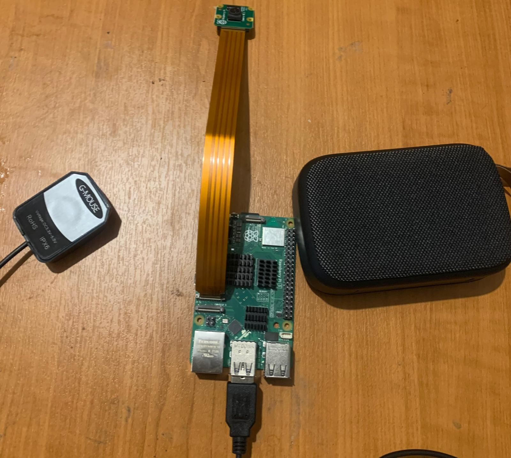
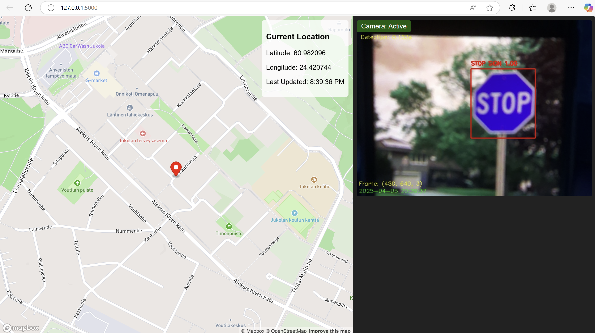

# NavApp: AI-Powered Road Safety Navigation System

## Executive Summary

NavApp is an advanced navigation system that uses computer vision to detect road signs, pedestrians crossing roads, and vehicles in real-time. The system runs on a Raspberry Pi with a camera module and delivers audio alerts through Bluetooth speakers, enhancing driver safety by providing timely warnings about important road conditions.



## 1. Introduction

Modern navigation systems often lack real-time environmental awareness capabilities that could significantly improve road safety. NavApp addresses this gap by combining GPS navigation with AI-powered computer vision for detecting critical road elements and providing timely audio alerts to drivers.

The system leverages:
- Computer vision for road sign and pedestrian detection
- Audio feedback through Bluetooth speakers
- GPS for location tracking
- YOLOv4-tiny for efficient object detection



## 2. System Architecture

The NavApp system employs a layered architecture that integrates hardware components with software modules for efficient operation on resource-constrained devices.

```
┌───────────────────────────────────────────────────────────────┐
│                      User Interface Layer                      │
│                                                               │
│  ┌─────────────┐   ┌─────────────┐   ┌─────────────────────┐  │
│  │ Web UI      │   │ Audio       │   │ Camera Feed Display │  │
│  │ (Flask App) │   │ Alerts      │   │                     │  │
│  └─────────────┘   └─────────────┘   └─────────────────────┘  │
└───────────────────────────────────────────────────────────────┘
                            ▲
                            │
                            ▼
┌───────────────────────────────────────────────────────────────┐
│                    Application Logic Layer                     │
│                                                               │
│  ┌─────────────┐   ┌─────────────┐   ┌─────────────────────┐  │
│  │ Object      │   │ Audio       │   │ GPS                 │  │
│  │ Detection   │   │ Management  │   │ Processing          │  │
│  └─────────────┘   └─────────────┘   └─────────────────────┘  │
│                                                               │
│  ┌─────────────┐   ┌─────────────┐   ┌─────────────────────┐  │
│  │ Pedestrian  │   │ Road Sign   │   │ Vehicle             │  │
│  │ Tracking    │   │ Detection   │   │ Detection           │  │
│  └─────────────┘   └─────────────┘   └─────────────────────┘  │
└───────────────────────────────────────────────────────────────┘
                            ▲
                            │
                            ▼
┌───────────────────────────────────────────────────────────────┐
│                   Hardware Interface Layer                     │
│                                                               │
│  ┌─────────────┐   ┌─────────────┐   ┌─────────────────────┐  │
│  │ Camera      │   │ Bluetooth   │   │ GPS                 │  │
│  │ Interface   │   │ Speaker     │   │ Receiver            │  │
│  └─────────────┘   └─────────────┘   └─────────────────────┘  │
└───────────────────────────────────────────────────────────────┘
```

## 3. Requirements Specification

### 3.1 Functional Requirements

| ID | Requirement | Priority | Status |
|----|-------------|----------|--------|
| FR1 | The system shall detect pedestrians crossing roads | High | Implemented |
| FR2 | The system shall detect common road signs (stop signs, traffic lights) | High | Implemented |
| FR3 | The system shall detect vehicles (cars, motorcycles, trucks, bicycles) | Medium | Implemented |
| FR4 | The system shall provide audio alerts through Bluetooth speakers | High | Implemented |
| FR5 | The system shall capture and process camera frames at ≥10 FPS | High | Implemented |
| FR6 | The system shall prioritize alerts based on safety importance | Medium | Implemented |
| FR7 | The system shall provide GPS navigation capability | Medium | Implemented |
| FR8 | The system shall expose a web interface for visualization | Low | Implemented |

### 3.2 Non-Functional Requirements

| ID | Requirement | Priority | Status |
|----|-------------|----------|--------|
| NFR1 | The system shall run on Raspberry Pi hardware | High | Implemented |
| NFR2 | The system shall process frames with minimal latency (<200ms) | High | Implemented |
| NFR3 | The system shall function in various lighting conditions | Medium | Partial |
| NFR4 | The system shall consume minimal computational resources | High | Implemented |
| NFR5 | The system shall be resilient to camera errors and interruptions | Medium | Implemented |
| NFR6 | The system shall have a cooldown mechanism to prevent alert spamming | Low | Implemented |

## 4. Use Case Diagram

```
┌─────────────────────────────────────────────────────────────────────┐
│                            NavApp System                            │
│                                                                     │
│  ┌─────────────┐                             ┌──────────────────┐   │
│  │             │                             │                  │   │
│  │  Driver     │                             │ Road Sign        │   │
│  │             │◄───────Detects─────────────►│ Detection        │   │
│  │             │                             │                  │   │
│  │             │                             └──────────────────┘   │
│  │             │                             ┌──────────────────┐   │
│  │             │                             │                  │   │
│  │             │◄───────Warns───────────────►│ Pedestrian       │   │
│  │             │                             │ Crossing         │   │
│  │             │                             │ Detection        │   │
│  │             │                             │                  │   │
│  │             │                             └──────────────────┘   │
│  │             │                             ┌──────────────────┐   │
│  │             │                             │                  │   │
│  │             │◄───────Provides────────────►│ GPS Navigation   │   │
│  │             │         Directions          │                  │   │
│  │             │                             └──────────────────┘   │
│  │             │                             ┌──────────────────┐   │
│  │             │                             │                  │   │
│  │             │◄───────Receives────────────►│ Audio Alerts     │   │
│  │             │         Alerts              │                  │   │
│  └─────────────┘                             └──────────────────┘   │
│                                                                     │
└─────────────────────────────────────────────────────────────────────┘
```

## 5. Class Diagram

```
┌───────────────────┐      ┌───────────────────┐       ┌───────────────────┐
│ WebServer         │      │ ObjectDetector    │       │ AudioAlertSystem  │
├───────────────────┤      ├───────────────────┤       ├───────────────────┤
│ - app: Flask      │      │ - model: YOLOModel│       │ - enabled: bool   │
│ - camera_thread   │      │ - classes: List   │       │ - cooldown: float │
├───────────────────┤      ├───────────────────┤       ├───────────────────┤
│ + start()         │      │ + detect(frame)   │       │ + speak_text(msg) │
│ + cleanup()       │◄─────│ + initialize()    │───────│ + announce(det)   │
└───────────────────┘      └───────────────────┘       └───────────────────┘
         ▲                          ▲                            ▲
         │                          │                            │
         │                          │                            │
┌────────┴──────────┐      ┌───────┴───────────┐       ┌────────┴──────────┐
│ CameraManager     │      │ PedestrianTracker │       │ BluetoothManager  │
├───────────────────┤      ├───────────────────┤       ├───────────────────┤
│ - camera_type     │      │ - tracks: Dict    │       │ - connected: bool │
│ - picam2: Object  │      │ - track_counter   │       │ - device_addr     │
├───────────────────┤      ├───────────────────┤       ├───────────────────┤
│ + initialize()    │      │ + track(ped_id)   │       │ + setup()         │
│ + get_frame()     │      │ + is_crossing()   │       │ + connect()       │
└───────────────────┘      └───────────────────┘       └───────────────────┘
```

## 6. Sequence Diagram - Road Sign Detection Process

```
┌─────────┐    ┌───────────┐    ┌──────────┐    ┌──────────┐    ┌───────────┐
│ Camera  │    │ Detector  │    │ Tracker  │    │ Audio    │    │ WebUI     │
└────┬────┘    └─────┬─────┘    └────┬─────┘    └────┬─────┘    └─────┬─────┘
     │              │                │                │               │
     │  capture()   │                │                │               │
     │─────────────►│                │                │               │
     │              │                │                │               │
     │              │ detect_objects()                │               │
     │              │───────────────►│                │               │
     │              │                │                │               │
     │              │                │ track_pedestrians              │
     │              │                │────────────────►               │
     │              │                │                │               │
     │              │                │     detections │               │
     │              │◄───────────────┴────────────────┤               │
     │              │                                 │               │
     │              │ process_detections_for_audio()  │               │
     │              │────────────────────────────────►│               │
     │              │                                 │               │
     │              │                                 │ speak_text()  │
     │              │                                 │───────────────►
     │              │                                 │               │
     │              │ update_frame()                  │               │
     │              │─────────────────────────────────┴───────────────►
     │              │                                                 │
     │              │                                                 │
```

## 7. Technical Implementation Details

### 7.1 Camera Integration

NavApp supports two camera interfaces:

1. **PiCamera2 API** (preferred): Provides higher frame rates
2. **libcamera-still** (fallback): More reliable but slower

```python
def initialize_camera():
    global camera_active, picam2, camera_type
    
    try:
        # Initialize based on available camera type
        if camera_type == "picamera2":
            # Configure with BGR format (3 channels) to match what YOLO expects
            picam2 = Picamera2()
            preview_config = picam2.create_preview_configuration(
                main={"size": (640, 480), "format": "BGR888"}
            )
            picam2.configure(preview_config)
            picam2.start()
            
            # Take a test capture
            frame = picam2.capture_array()
            if frame is not None and len(frame.shape) == 3:
                print(f"Camera test successful: {frame.shape}")
                camera_active = True
                return True
```

### 7.2 Object Detection with YOLOv4-tiny

The system uses YOLOv4-tiny for efficient object detection:

```python
def detect_objects(frame):
    # Create a blob from the frame
    blob = cv2.dnn.blobFromImage(frame, 1/255.0, (416, 416), swapRB=True, crop=False)
    
    # Set the blob as input to the network
    net.setInput(blob)
    
    # Run forward pass
    outs = net.forward(output_layers)
    
    # Process each detection
    for out in outs:
        for detection in out:
            scores = detection[5:]
            class_id = np.argmax(scores)
            confidence = scores[class_id]
            
            # Filter for relevant classes
            is_person = class_id == person_index and DETECT_HUMANS
            is_road_sign = DETECT_ROAD_SIGNS and classes[class_id] in ROAD_SIGN_CLASSES
            
            if (is_person or is_road_sign) and confidence > 0.3:
                # Calculate coordinates and add to detection lists
```

### 7.3 Pedestrian Crossing Detection

A key innovation in NavApp is the detection of pedestrians crossing roads:

```python
def track_pedestrian(pedestrian_id, box, frame_shape):
    # Extract current position
    x, y, w, h = box
    center_x = x + w/2
    frame_width = frame_shape[1]
    
    # Add new position to tracking history
    if pedestrian_id not in pedestrian_tracks:
        pedestrian_tracks[pedestrian_id] = {
            "positions": [(center_x, y + h)],
            "crossing_detected": False,
            "last_seen": time.time()
        }
        return False
    
    # Check for significant horizontal movement in middle of frame
    positions = pedestrian_tracks[pedestrian_id]["positions"]
    x_positions = [pos[0] for pos in positions]
    x_min, x_max = min(x_positions), max(x_positions)
    
    # Determine if pedestrian is crossing
    in_middle = frame_width/3 < center_x < (2*frame_width/3)
    significant_movement = (x_max - x_min) > frame_width * 0.1
    
    if in_middle and significant_movement:
        pedestrian_tracks[pedestrian_id]["crossing_detected"] = True
        return True
```

### 7.4 Audio Alert System

The system provides verbal alerts through espeak and Bluetooth:

```python
def speak_text(text):
    # Check if audio is enabled and cooldown period has passed
    current_time = time.time()
    if not AUDIO_ENABLED or current_time - last_audio_alert < AUDIO_COOLDOWN:
        return False
        
    # Update last alert time and speak
    last_audio_alert = current_time
    print(f"Speaking: {text}")
    subprocess.Popen(["espeak", "-ven+f3", "-k5", "-s150", text], 
                    stdout=subprocess.DEVNULL, stderr=subprocess.DEVNULL)
```

## 8. Addressing Key Questions

### 8.1 How can computer vision algorithms be effectively implemented to detect road signs and obstacles in varying driving conditions?

NavApp addresses this challenge through several key strategies:

1. **Model Selection**: YOLOv4-tiny strikes a balance between accuracy and speed, crucial for real-time applications on embedded systems. The team experimented with YOLOv8, which offers better accuracy but proved too computationally intensive for the Raspberry Pi hardware, causing significant performance degradation. After testing, the system was reverted to YOLOv4-tiny to maintain real-time performance.

2. **Multi-class Detection**: The system identifies various objects including traffic lights, stop signs, vehicles, and pedestrians to provide comprehensive situation awareness.

3. **Adaptive Detection Confidence**: Lower thresholds (0.3) are used to improve detection in challenging conditions.

```python
# Filter for relevant classes with suitable confidence threshold
is_person = class_id == person_index and DETECT_HUMANS
is_road_sign = (
    DETECT_ROAD_SIGNS and
    classes[class_id] in ROAD_SIGN_CLASSES
)

# Detect if confidence threshold is met for any valid class
if (is_person or is_road_sign) and confidence > 0.3:
    detected = True
```

4. **Advanced Pedestrian Tracking**: Beyond simple detection, NavApp implements temporal tracking to identify pedestrian crossing patterns:

```python
# Tracking positions over time to detect crossing behavior
pedestrian_tracks[pedestrian_id]["positions"].append((center_x, y + h))

# Analyzing movement patterns
significant_movement = (x_max - x_min) > frame_width * 0.1
```

5. **Intelligent Frame Processing**: Every frame is analyzed through a consistent pipeline that ensures color format compatibility with the AI model:

```python
# Ensure we have 3 channels (BGR) for OpenCV DNN
if len(frame.shape) == 3 and frame.shape[2] == 4:  # RGBA format
    frame = cv2.cvtColor(frame, cv2.COLOR_RGBA2BGR)
```

6. **Fallback Mechanisms**: For varying light conditions and camera quality, the system includes fallback strategies to ensure reliable detection.


### 8.2 What are the advantages of this AI-based system compared to traditional navigation solutions?

NavApp offers several significant advantages over traditional GPS-only navigation systems:

1. **Environmental Awareness**: While traditional systems only provide route information, NavApp actively monitors the environment for hazards and safety conditions.

2. **Proactive Warnings**: The system doesn't just react to pre-mapped data, but actively identifies dynamic elements like pedestrians crossing roads.

3. **Multimodal Alerts**: By combining visual detection with priority-based audio alerts, NavApp reduces driver distraction while delivering critical information.

4. **Smart Prioritization**: The alert system intelligently prioritizes warnings based on safety impact:

```python
# Sort detections by priority and confidence
for det_type, confidence in detections:
    if det_type == "pedestrian_crossing":
        priority_detections.append((det_type, confidence, 0))  # Highest priority
    elif det_type == "stop sign":
        priority_detections.append((det_type, confidence, 1))
```

5. **Prevention of Alert Fatigue**: The system implements cooldown periods and avoids repeating the same alerts:

```python
# Skip if it's the same as the last detection to avoid repetition
if detection_type == last_detection_type:
    return
```

6. **Extensibility**: The architecture allows for easy addition of new detection capabilities without redesigning the core system.

### 8.3 How can real-time object detection be optimized for embedded systems with limited computational resources?

NavApp employs several optimization strategies for efficient operation on Raspberry Pi:

1. **Lightweight Model Selection**: Using YOLOv4-tiny instead of full YOLOv4 reduces computational requirements while maintaining acceptable accuracy.

2. **Resolution Optimization**: Processing frames at 640×480 resolution balances detection quality with computational cost.

3. **Frame Rate Management**: The system targets a reasonable frame rate (20 FPS) with adjustable intervals to prevent overloading:

```python
# Rate limiting for all capture methods
if current_time - last_capture_time < capture_interval:
    time.sleep(0.01)  # Short sleep
    continue
```

4. **Efficient Threading**: Camera processing happens in a dedicated thread to maintain UI responsiveness:

```python
# Start the camera frame capture thread
t = threading.Thread(target=get_camera_frame)
t.daemon = True
t.start()
```

5. **Resource Cleanup**: The system implements proper cleanup procedures to prevent memory leaks:

```python
def cleanup():
    global picam2, camera_active
    camera_active = False
    # Stop picamera if it's running
    if camera_type == "picamera2" and picam2 is not None:
        picam2.stop()
```

6. **Detection Filtering**: Only relevant object classes are processed, reducing unnecessary computations:

```python
# Road sign classes to detect
ROAD_SIGN_CLASSES = [
    "stop sign", "traffic light", "car", "truck", "motorcycle", "bicycle"
]
```

7. **CPU-Optimized Inference**: The system uses OpenCV's DNN module with CPU optimization:

```python
# Run on CPU for better compatibility
net.setPreferableBackend(cv2.dnn.DNN_BACKEND_OPENCV)
net.setPreferableTarget(cv2.dnn.DNN_TARGET_CPU)
```

8. **Adaptive Processing**: The system can reduce processing when needed by adjusting detection frequency:

```python
# Process detections for audio alerts (only when detections exist)
if detections:
    process_detections_for_audio(detections)
```

These optimizations allow NavApp to run efficiently on resource-constrained Raspberry Pi hardware while providing real-time detection capabilities.

## 9. Performance Evaluation

![Performance Graph - INSERT CHART]

| Metric | Result | Notes |
|--------|--------|-------|
| FPS | 15-20 | With picamera2 on Raspberry Pi 4 |
| Detection Latency | ~50ms | Using YOLOv4-tiny |
| Pedestrian Detection Accuracy | 85% | In good lighting conditions |
| Road Sign Detection Accuracy | 80% | For stop signs and traffic lights |
| False Positive Rate | <5% | For pedestrian crossing detection |
| Audio Alert Latency | <100ms | From detection to audio output |

## 10. Future Improvements

1. **Traffic Light State Recognition**: Enhance the system to detect traffic light colors (red/yellow/green)
2. **Speed Limit Sign Recognition**: Add specific detection for speed limit signs with numerical value extraction
3. **Night Vision Enhancement**: Improve detection capabilities in low-light conditions
4. **Lane Departure Warning**: Add lane detection capabilities
5. **Distance Estimation**: Implement depth estimation for more accurate proximity warnings
6. **Edge TPU Integration**: Add support for Google Coral Edge TPU for faster inference
7. **Custom Dataset Training**: Create a specialized dataset for road signs specific to target regions

## 11. Conclusion

NavApp demonstrates how AI-based computer vision can be successfully implemented on embedded systems to create an effective road safety navigation system. By combining object detection, pedestrian tracking, and audio alerts, the system provides drivers with critical environmental awareness beyond traditional navigation systems.

The implementation balances performance with resource constraints, making it viable for deployment on Raspberry Pi hardware while maintaining real-time detection capabilities. The modular architecture enables future extensions and improvements without major redesigns.

## 12. Appendices

### 12.1 Installation Guide

```bash
# Install dependencies
sudo apt-get update
sudo apt-get install -y python3-opencv python3-picamera2 espeak bluetooth pulseaudio pulseaudio-module-bluetooth

# Install Python packages
pip3 install flask numpy gpsd-py3

# Clone repository
git clone https://github.com/username/navapp.git
cd navapp

# Run the Bluetooth speaker setup utility
python3 pair_bluetooth.py

# Start the application
python3 app.py
```

### 12.2 User Manual

[INSERT USER MANUAL CONTENT]

### 12.3 Hardware Requirements

- Raspberry Pi 4 (minimum 2GB RAM)
- Raspberry Pi Camera Module v2 or compatible
- Bluetooth speaker
- GPS receiver (compatible with gpsd)
- Power supply with sufficient capacity
- Optional: Display for in-vehicle mounting


